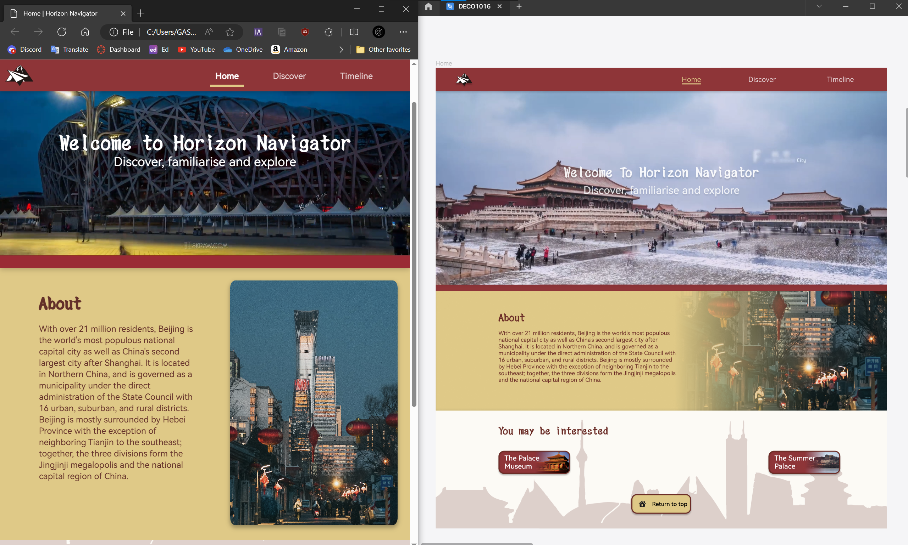
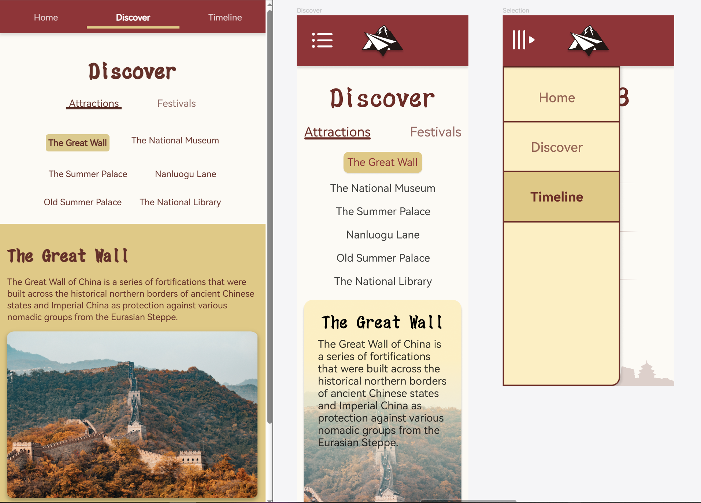

# Horizon Navigator


***Please be advised that as I'm introducing the capital city of China, the hyperlinks on this microsite will most likely be directed to a Mandarin page, use web translators if possible :)***

## Implementation decisions

This microsite is designed to serve as a simple guide for people travelling to Beijing for the first time, and it aims to provide a place where people can quickly learn about famous local attractions and customs as well as special events.

My microsite features several benefits:

* Major attractions, events and festivals are all gathered on this microsite, so no more massive Google search for a proper travel guide that fits your timing.
* Users can quickly find what they need on the microsite and can always access the source through the hyperlink.
* The site serves only as a simple navigator and takes information from the source, the content is always up-to-date, so not misleading and outdated info.

My design is based on Beijing, China's capital and political centre. This is a city full of history with many places of interest. There are 3 main functions on my microsite:

1. The home page introduces the city with a few recommendations to get you quickly started.
2. The discover page lists the famous attractions, by toggling the display filter, you can also see some famous festivals.
3. The timeline page displays recent events, you can use a time slider to look at upcoming or past events within the current year.

## Mockups and prototype comparisons



I found that using gradient masking to fit the image into the right side of the text is a hard approach without the help of javascript, so I ended up using separate divs to fill in the image and the text, under the container div (coloured yellow as background).

To enhance the sense of hierarchy and to add a bit more detail, I put rounded corners on the image and added some shadows.



I replaced the dark context colour from black to dark red so it creates a better consistency with other colours and still maintains a good contrast.

The navbar now has a simplified look on narrow browser windows in order to improve the experience for mobile users. The logo now hides when clicking on it as it does no difference with the "Home" tag. The links now expand to evenly split the horizontal space of the browser window, making it easier to select.

## Further iterations/improvements

Currently, the microsite has a complete shape but seems a bit stiff, most elements on the page are static. I plan to add more user interaction feedback on the microsite.

For example, when the mouse hovers over an image, the image becomes bigger and slightly 3D rotates according to the mouse position, feels like it's popping out from the microsite. Things like this will significantly boost the user experience.

## Iconic code blocks

```html
<div class="video-container">
    <!-- From https://www.w3schools.com/tags/tag_video.asp-->
    <video autoplay loop muted >
      <source src="vid.mp4" type="video/mp4">
    </video>
    <!-- To make sure the texts are sharp and sticks to the same position on the video the all time, I set up a new div for them -->
    <!-- These are essentially h1 and h2, but I used a specific name for them so it is easier to locate them in css-->
    <vidTitle>Welcome to Horizon Navigator</vidTitle>
    <vidSub>Discover, familiarise and explore</vidSub>
  </div>
```

```css
.video-container vidTitle {
  position: absolute; /* The anchor position of the text is modified here (for the entire video) */
  top: 50%;
  left: 50%;
  transform: translate(-50%, -100%); /* The text position is slightly tuned for the new anchor position */
  font-family: TSYT;
  color: white;
  white-space: nowrap;/*The texts are not supposed to auto wrap*/
  font-size: 5vw;/*When the window width changes, the text size changes as well*/
}

.video-container vidSub {
  position: absolute; /* Same as the VidTitle */
  top: 50%;
  left: 50%;
  transform: translate(-50%); 
  font-family: HarmonyOS;
  color: white;
  font-size: 3vw;
  /*box-shadow: 0 3px 6px rgba(0, 0, 0, 0.2); I was planning to add shadows to the texts on the video as well, but they ended up making a transparent border with shadows, so I have to disable this line*/
}

```

This is the part where I created multiple divs to fit in the video and the texts above it.

There are also codes coming from external referencing documents such as the code that **stops the rubberband effect**.

```css
overscroll-behavior: none; /*This will prevent the browser's built-in rubber band effect when scrolling, from https://developer.mozilla.org/en-US/docs/Web/CSS/overscroll-behavior */
```

And this line adds **colour and corner radius transition**.

```css
transition: background-color 0.3s ease, border-radius 0.3s ease;/*https://stackoverflow.com/questions/7048313/how-to-have-multiple-css-transitions-on-an-element*/
```

